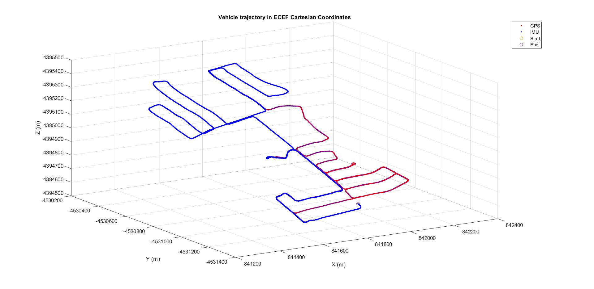
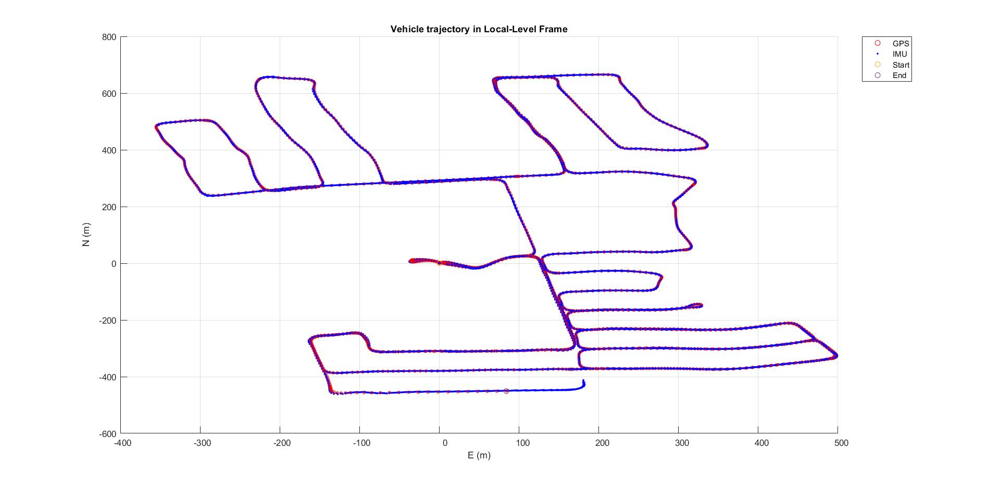
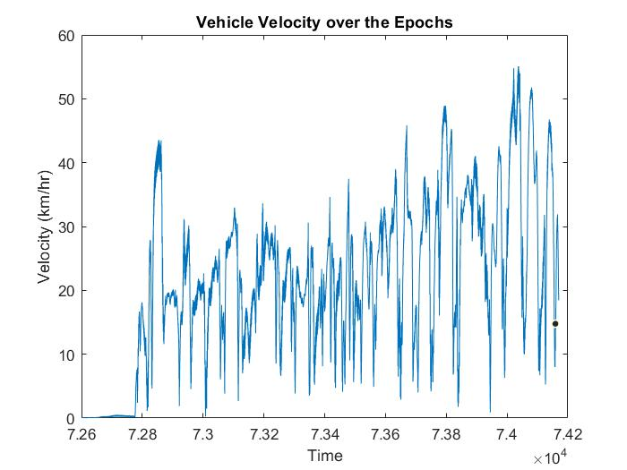
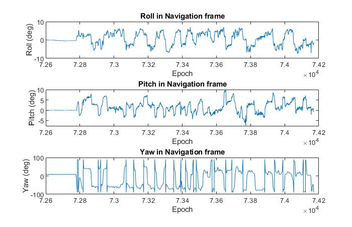

# Loose-GNSS-IMU
Loose-coupling is the most commonly used method for integrating GNSS-IMU due to its efficiency and simplicity. The idea is to treat the two sensors completely independent of each other. For the inertial sensor, the summation of acceleration and angular rate over time is used to produce position, velocity and attitude solutions (aka. mechanization). Concurrently, the GNSS sensor also generates position and velocity solutions, albeit at a slower rate than the inertial sensor. Both solutions are then combined at specific intervals using a Kalman filter in order to estimate the error states of the inertial sensor like biases or scale factors. These error estimates are used in a recursive manner to improve the accuracy of the inertial navigation solution. 

The IMU mechanization is performed in ECEF Cartesian coordinates as described in the Paul Groves textbook : Principles of GNSS, Inertial, and Multisensor Integrated Navigation Systems, 2nd Edition. 

## Installation
You need Eigen 3.3.7 and Visual Studio 2017. I have included eigen here along with relative path property so that you can simply download the project and open "Loose-GNSS-IMU.sln". You can find more info about using eigen with VS [here](http://eigen.tuxfamily.org/index.php?title=Visual_Studio).

## Testing
You will find instructions in "Loose-GNSS-IMU.cpp" where you need to set the path of the input files, but pay attention to the file format. You can find input file samples in the "Input" folder. Simply recreate your input to accommodate the format supported by the reader provided in this program. 

## Results
ECEF Solution                                       |  2-D Solution in LLF
:--------------------------------------------------:|:--------------------------------------------------:
  |  

Vehicle Velocity                                        |  Attitude
:------------------------------------------------------:|:------------------------------------------------------:
  |  

## License
Free-to-use (MIT), but at your own risk. Credits to Eigen Library. 
